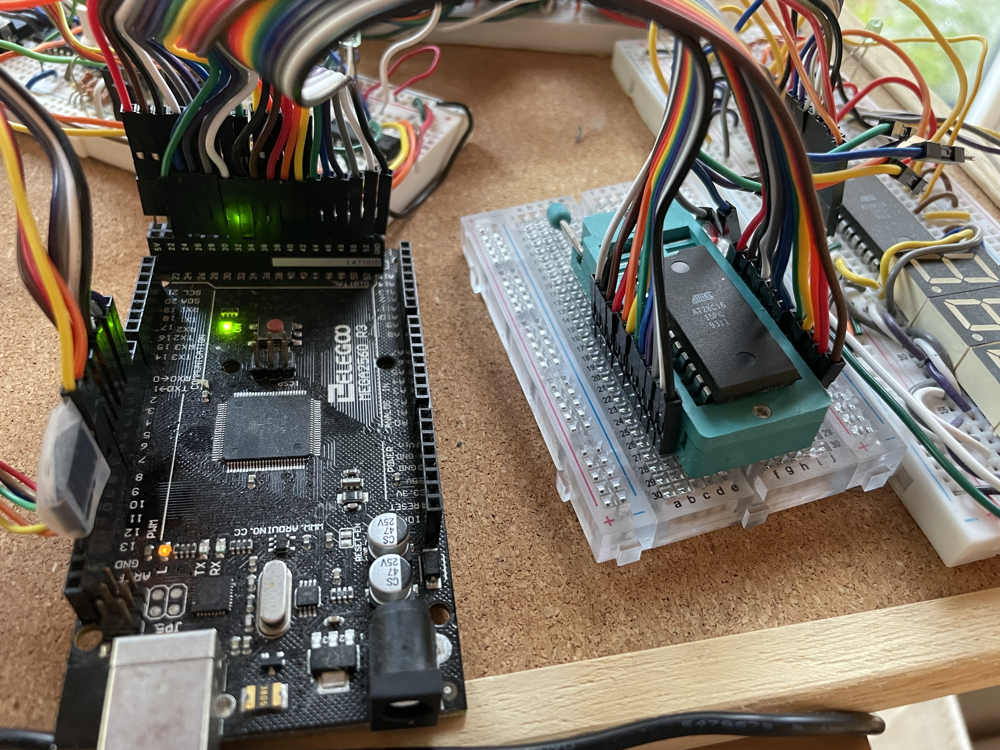
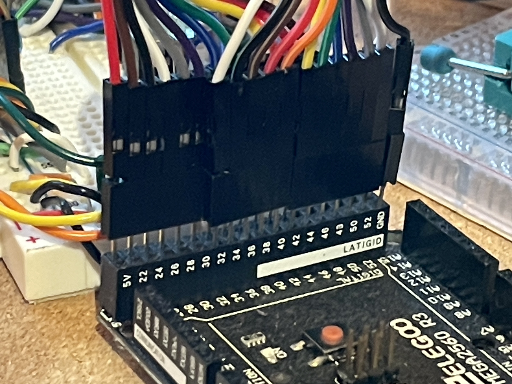
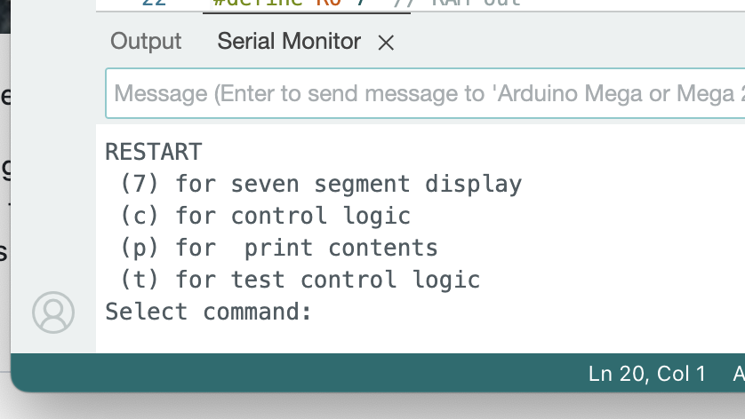
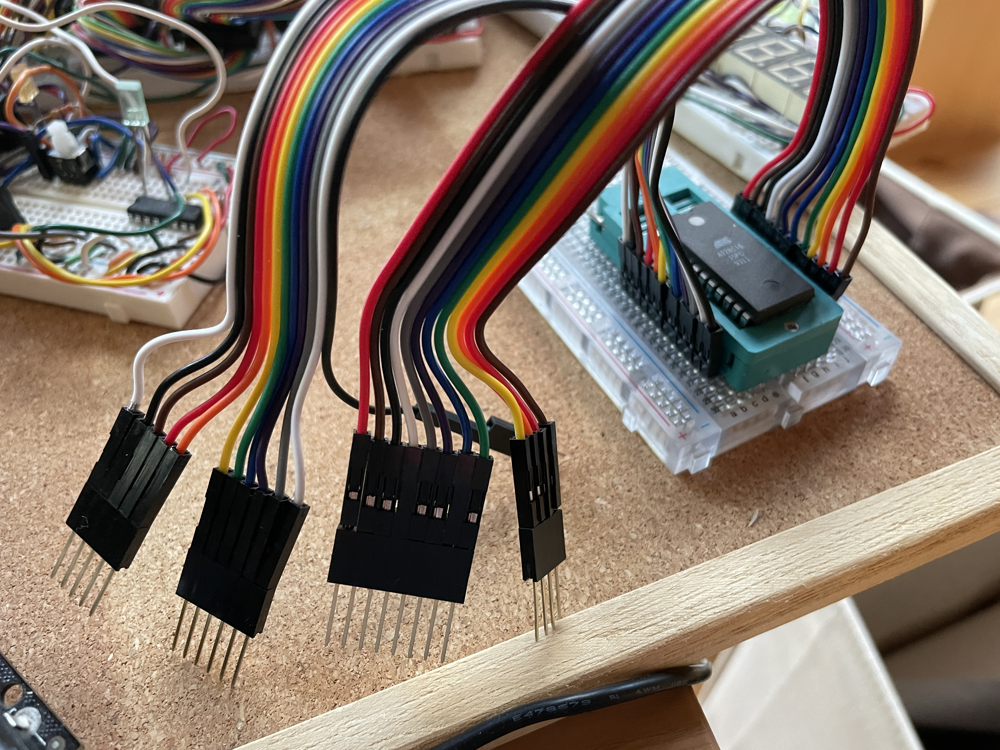
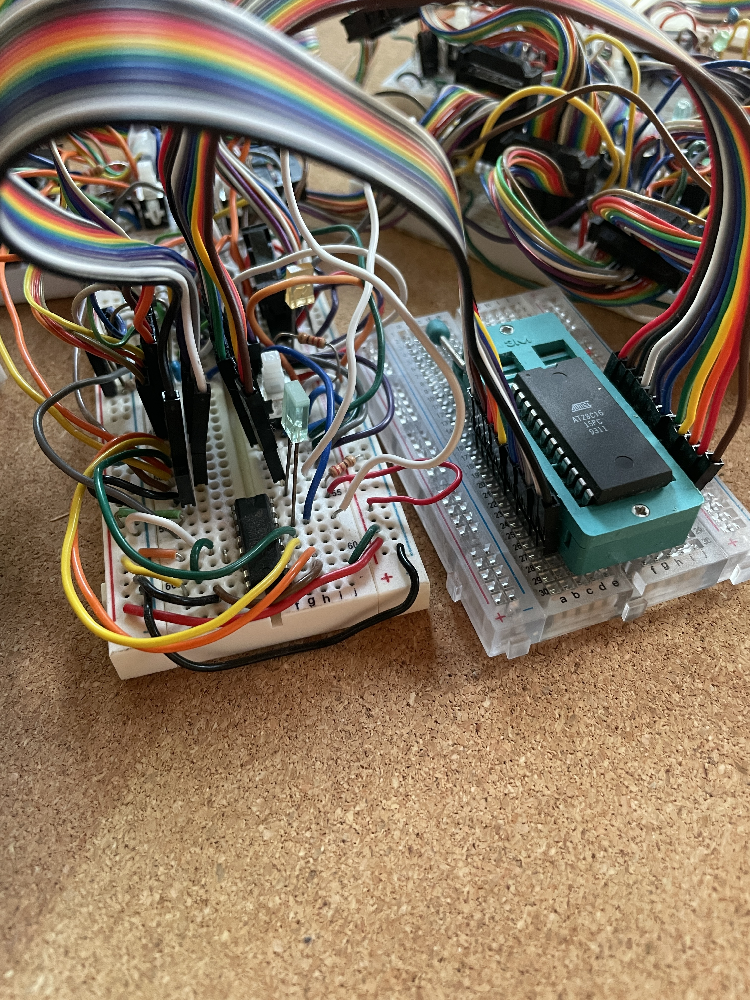

# Yet Another EEPROM programmer for AT28C16/sst39sf0

Code for using arduino mega for programming at28C16pc and SST39F0 eeprom chips
based on code from [ben eater](https://github.com/beneater/eeprom-programmer), [jmd9999](https://forum.arduino.cc/t/cannot-erase-write-sst39sf010a-flash-memory/951490), and [doctor audrey](https://github.com/doctorandrey/39SF040_Programmer).

Some of these programs use shift registers, but since the mega has enough pins, we are just directly writing pins

Most programmers have a complicated wiring scheme, but I wanted a simple wire scheme.  I use a ribbon cable which fits into the 22-52 pins.  It is easier to change the wires in the code, rather than the physical wires.  The left side of the chip is on the even pins (ending with GND) and the right side of the chip is on the odd pins (starting with VCC).
The same programmer can be used with at28C16pc and SST39F0 by just changing the pins and a few minor differences in the code.

Some programs have a complicated parser in the serial monitor and I had trouble getting it to work.  So I am using a simple serial monitor where a single letter triggers a function.  

One advantage of using a ribbon cable with a straightforward mapping to pins is that it is possible to easily disconnect the zif socket from the programmer and then connect it into the 8-bit computer for testing.  This means that you don't need to carefully remove the EEPROM from your board each time you want to test it.

[Ben Eater's control logic](https://www.youtube.com/watch?v=FCscQGBIL-Y) involves individual binary signals for each component that is connected to the bus.  [In my computer](https://www.youtube.com/watch?v=CHGl77YNiHg), I have one output decoder with three bits that control which component is outputting to the bus and another decoder with four bits that controls which component is inputting to the bus.

| Number | Output Instruction   | Name OUT |   | Name IN              | Name IN |
|--------|----------------------|----------|---|----------------------|---------|
| 0      | No operation         | NOP      |   | No operation         | NOP     |
| 1      | Register B           | BO       |   | Register B           | BI      |
| 2      | ALU                  | EO       |   | Register A           | AI      |
| 3      | Register A           | AO       |   | Instruction Register | II      |
| 4      | Instruction Register | IO       |   | Display              | OUT     |
| 5      | Program Counter      | CO       |   | Memory Register      | MI      |
| 6      | Memory Register      | MO       |   | RAM                  | RI      |
| 7      | RAM                  | RO       |   | JUMP                 | J       |
