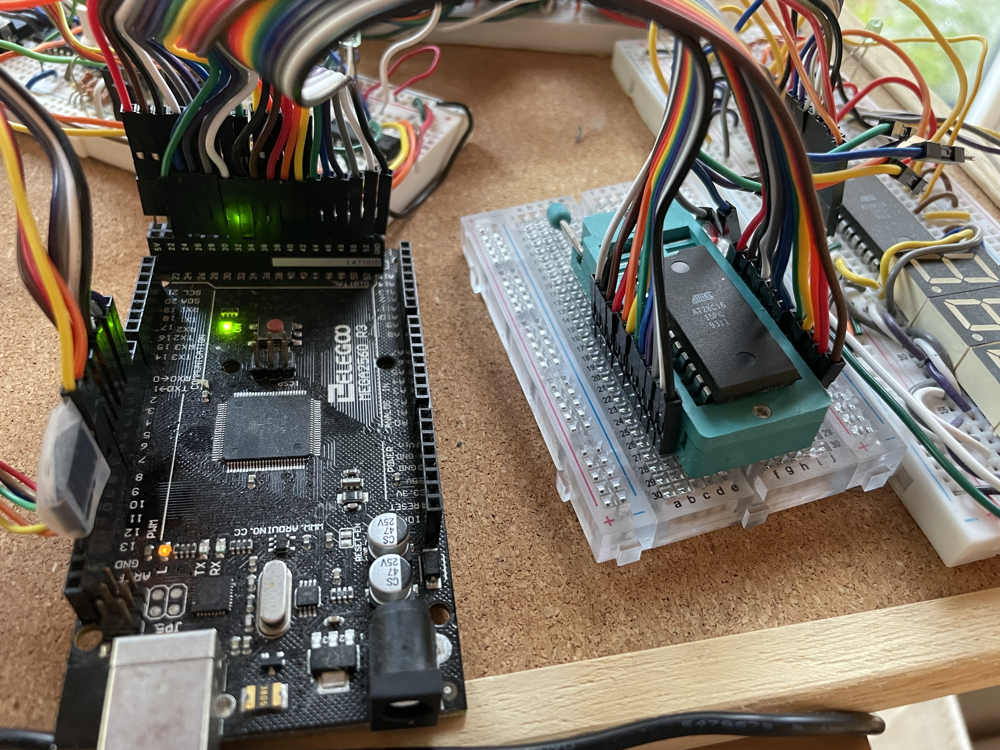
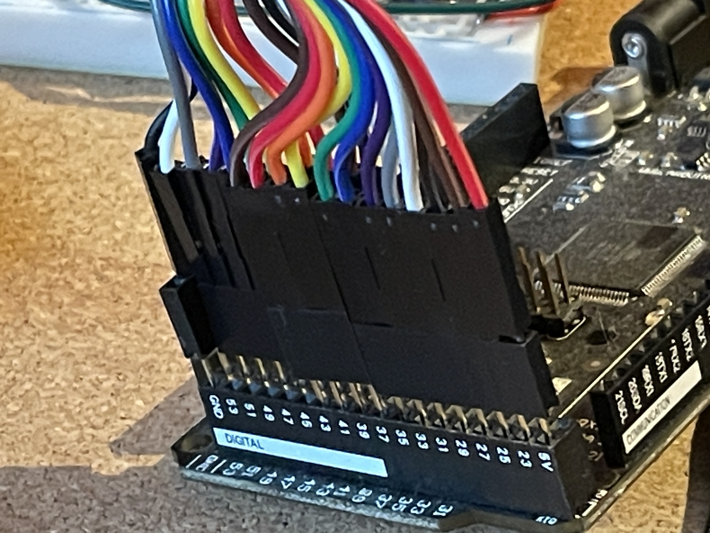
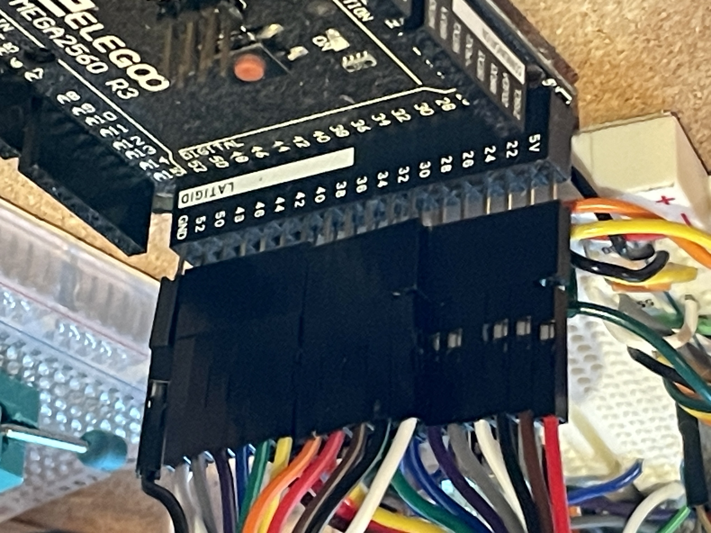

# EEPROM programmer for AT28C16

Code for using arduino mega for programming at28C16pc eeprom chips
based on code from ben eater, jmd9999, doctor audrey

https://forum.arduino.cc/t/cannot-erase-write-sst39sf010a-flash-memory/951490

https://github.com/doctorandrey/39SF040_Programmer

https://github.com/beneater/eeprom-programmer

Some of these programs use shift registers, but since the mega has enough pins, we are just directly writing pins

most programmers have some complicated wiring scheme, but I wanted
a simple wire scheme and then a way to link the wires in the code.
I use a ribbon cable which fits into the 22-52 pins.

I use simple serial monitor for commands.  One character calls a function.

The final goal was to have similar code for programming eeproms like the at28C16pc.
The wiring does not need to be changed, just different pins are defined at the start.
the same function names are used, but some of the code inside is different.
In some programmers, writeByte has address first and data second, and sometimes it is reversed.
I prefer putting address is first.
