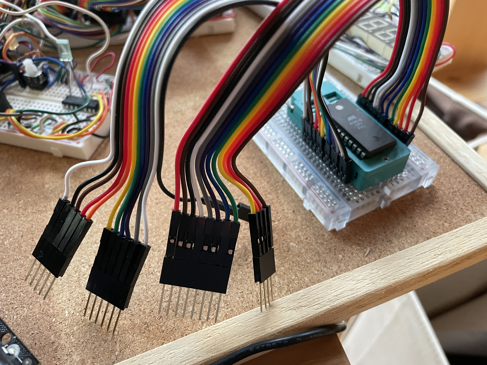
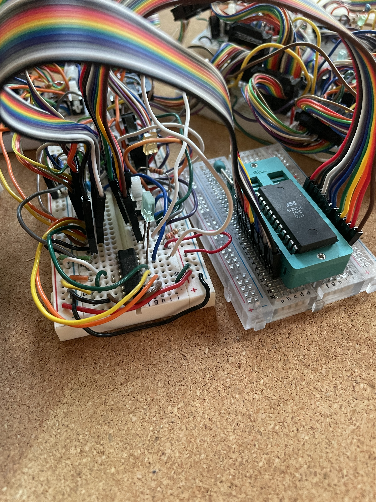

# Yet Another EEPROM programmer for AT28C16/sst39sf0

Code for using arduino mega for programming at28C16pc eeprom chips
based on code from ben eater, jmd9999, doctor audrey

https://forum.arduino.cc/t/cannot-erase-write-sst39sf010a-flash-memory/951490

https://github.com/doctorandrey/39SF040_Programmer

https://github.com/beneater/eeprom-programmer

Some of these programs use shift registers, but since the mega has enough pins, we are just directly writing pins

Most programmers have a complicated wiring scheme, but I wanted a simple wire scheme.  I use a ribbon cable which fits into the 22-52 pins.  It is easier to change the wires in the code, rather than the physical wires.  The left side of the chip is on the even pins (ending with GND) and the right side of the chip is on the odd pins (starting with VCC).

Some programs have a complicated parser in the serial monitor and I had trouble getting it to work.  So I am using a simple serial monitor where a single letter triggers a function.  

One goal was to have similar code for programming different eeproms such as SST39F0.
The same wiring can be used for both programmers with just different pins defined in code.

In some programmers, writeByte has address first and data second, and sometimes it is reversed. I prefer putting address is first.

One advantage of using a ribbon cable with a straightforward mapping to pins is that it is possible to easily disconnect the zif socket from the programmer and then connect it into the 8-bit computer for testing.  This means that you don't need to carefully remove the EEPROM from your board each time you want to test it.

